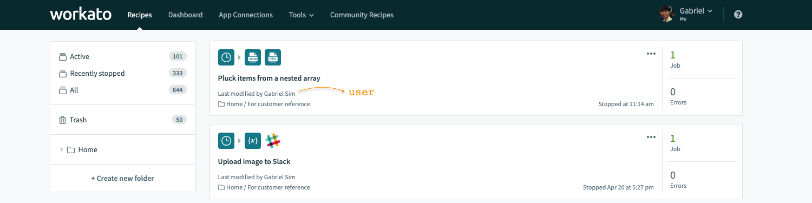
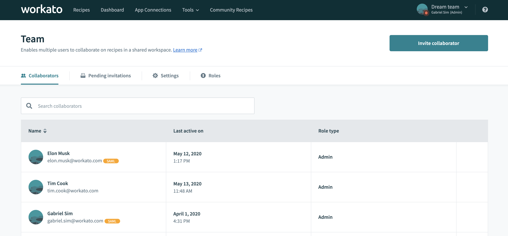

# WorkatoX

Operate Workato faster by ~~crook~~ or by `javascript` hooks

## Getting Started

### Installing

Install this Chrome extension.

### Configuration

Toggle the features that you want.

*Merely an illusion of control, you'll probably select everything.*

## Features

Quick Switcher
-----
*The only way to quickly switch between 50 teams in 1 minute (buffer another 10 minutes for dial-up internet)*

 

Show Bot Commands
-----
*So you're the one using my `submit form` command as well!*

*Supports Slack, Teams, Workplace*

 

Show Last Modified by
------
*At a glance, I can tell who messed up my recipes.*

 

Identify Public Recipes
------
*Bright orange label so you don't miss it. Do I really want these recipes public?*

 

Show if member has SAML enabled
------
*Another bright orange label so that I don't miss it. Yep, I'll just turn off SAML auth for you so it doesn't add to Google's 14M search results for "SAML issues"*

 

Skip connection setup when using community recipes
------
*No, I don't have a BambooHR connector, but let me play with fire anyway*

 

Show Enhanced Job Report
------
*How on earth did that value come about?! Oh, I see now...*

